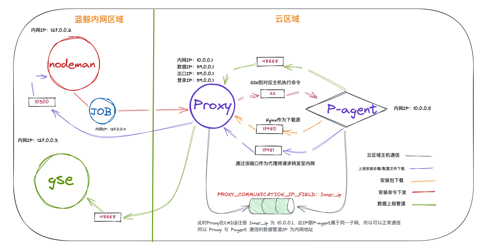
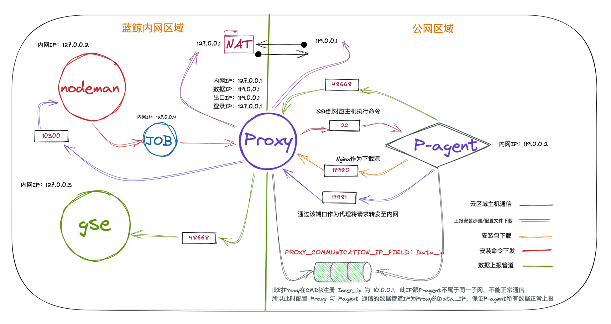

## 云区域主机通信字段变更

### 问题描述

  - 部分企业内网络复杂，需要在云区域主机通信时，并不能根据 Proxy 和 P-Agent 之间的内网进行通信，需要通过公网进行通信
  - 为了满足这种需求，需要在云区域主机通信时，增加一个字段，用于指定 Proxy 在节点管理注册的相关 IP 地址，用于与 P-Agent 进行通信
  - 该场景下，企业使用的是公网 IP 在 CMDB 进行注册，而 Proxy 是使用内网 IP 进行注册，这样就会导致云区域主机通信失败

### 综上所述，节点管理提供定制化需求，增加配置项来解决相关复杂网络架构

  - 增加配置 `PROXY_COMMUNICATION_IP_FIELD`, 默认为 `inner_ip`，可指定为 `data_ip`, `login_ip` 等
  - 在图二场景下, 在节点管理安装 Proxy 时，可以指定 `数据IP` 为 Proxy 在 NAT 转换后的地址, 并且在节点管理 `admin` 页面
全局配置表新增配置 `PROXY_COMMUNICATION_IP_FIELD` 为 `data_ip`，这样就可以实现将 P-Agent 的 `GSE` 相关上游地址配置为 Proxy
的公网地址，并且将相关上报代理地址指向 Proxy 上的 Nginx, 从而转发到蓝鲸内网的节点管理后台.

### 云区域主机通信流程图

#### Proxy 用内网与 P-Agent 通信符合大部分跨云管控场景

#### Proxy 使用内网管控，但是通过公网与 P-Agent 通信
